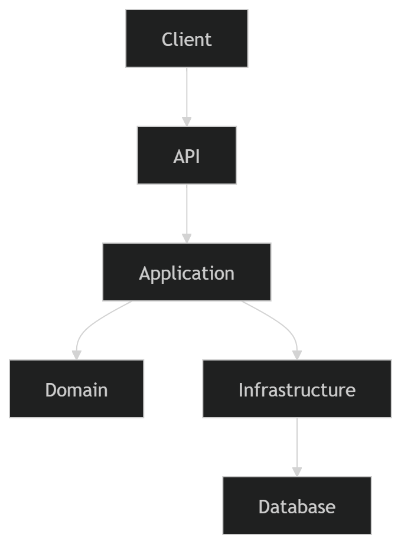
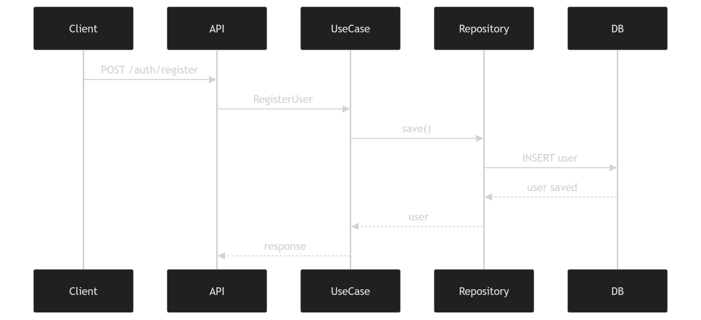
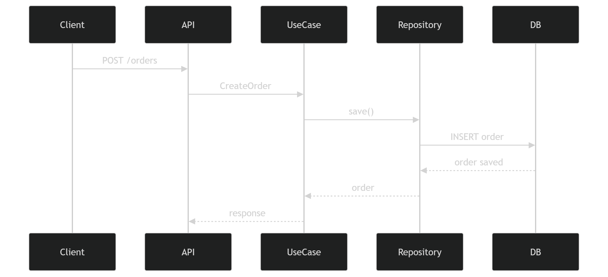

# Orders Service

Microservicio desarrollado con FastAPI usando arquitectura hexagonal para:

- Registro de usuarios
- Login con JWT
- Creación de órdenes

## Arquitectura

- Domain
- Application
- Infrastructure
- API

## Instalacion

poetry install

## Migraciones

poetry run alembic upgrade head

## Ejecutar

poetry run uvicorn orders_service.api.main:app --reload

## Tests

poetry run pytest -v

## Docker

docker build -t orders-service .
docker run -p 8000:8000 orders-service

## Endpoints

POST /auth/register
POST /auth/login
GET /users
POST /orders
GET /health

# Diagrams

## Architecture

## Authentication Flow

## Orders Flow

